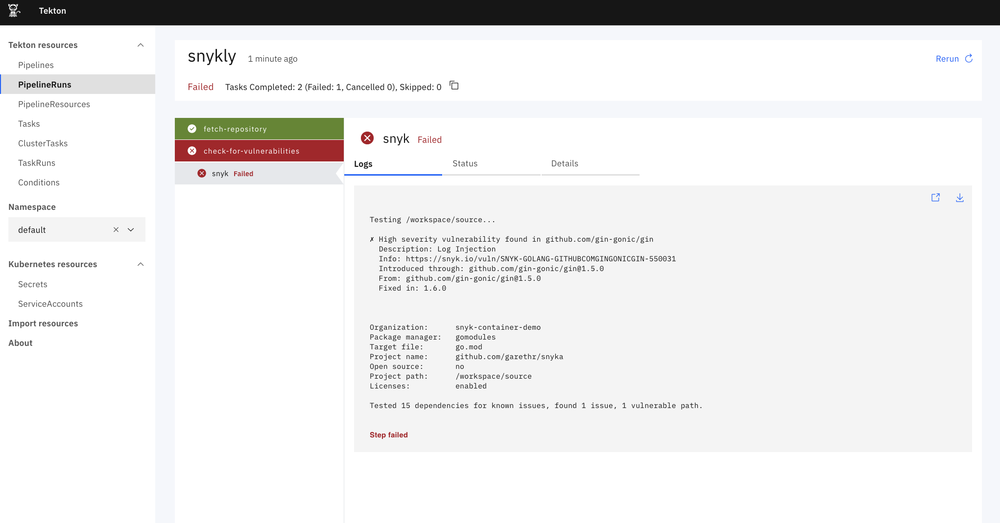

# Snyk Tekton Tasks


A set of [Tekton Tasks](https://tekton.dev/) for using [Snyk](https://snyk.io) to check for
vulnerabilities in your projects. A different task is required depending on which language or build tool
you are using. We currently support:

* [DotNet](dotnet)
* [Golang](golang)
* [Gradle](gradle)
* [Maven](maven)
* [Node](node)
* [PHP](php)
* [Python](python)
* [Ruby](ruby)
* [Scala](scala)
* [Swift](swift)

Here's an example of using one of the Tasks, in this case to test a Go project:



An example pipeline definition using several of these tasks together:

```yaml
apiVersion: tekton.dev/v1beta1
kind: Pipeline
metadata:
  name: snyk-golang-pipeline
spec:
  params:
  - name: git-url
  - name: git-revision
    default: master
  workspaces:
  - name: shared-workspace
  tasks:
  - name: fetch-repository
    taskRef:
      name: git-clone
    workspaces:
    - name: output
      workspace: shared-workspace
    params:
    - name: url
      value: $(params.git-url)
    - name: revision
      value: $(params.git-revision)
  - name: check-for-vulnerabilities
    taskRef:
      name: snyk-golang
    runAfter:
    - fetch-repository
    workspaces:
    - name: source
      workspace: shared-workspace
  - name: check-for-container-vulnerabilities
    taskRef:
      name: snyk-container
    params:
    - name: image
      value: ubuntu:18.04
    - name: args
      value:
      - --severity-threshold=high
    runAfter:
    - fetch-repository
    workspaces:
    - name: source
      workspace: shared-workspace

  - name: check-for-misconfigurations
    taskRef:
      name: snyk-iac
    params:
    - name: file
      value: deployment.yaml
    runAfter:
    - fetch-repository
    workspaces:
    - name: source
      workspace: shared-workspace

---
apiVersion: v1
kind: PersistentVolumeClaim
metadata:
  name: snykly-source-pvc
spec:
  resources:
    requests:
      storage: 200M
  volumeMode: Filesystem
  accessModes:
  - ReadWriteOnce
---
apiVersion: tekton.dev/v1beta1
kind: PipelineRun
metadata:
  name: snykly
spec:
  params:
  - name: git-url
    value: https://github.com/garethr/snykly
  pipelineRef:
    name: snyk-golang-pipeline
  workspaces:
  - name: shared-workspace
    persistentvolumeclaim:
      claimName: snykly-source-pvc
```


See the individual Actions linked above for per-language instructions.
